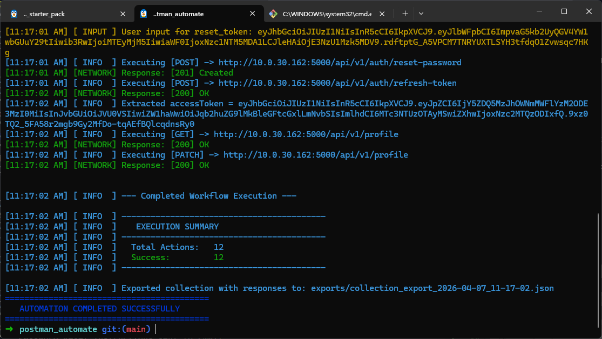

# Postman AI Automator

**Status:** Beta v1



A small CLI that turns a Postman Collection into a step-by-step JSON workflow (REGISTER / INPUT / LOG / EXECUTE), using Gemini to plan the flow and then execute it. It also saves generated workflows for reuse and writes detailed logs while it runs.

Currently it is in Beta test version. Many more things there is to be fixed. And I will continue to work on this.

## Architecture

The project now follows a core-first structure:

- Core runner: `src/core/run-automation.ts`
    - Owns collection loading, workflow load/generation, validation, execution, and outputs.
- CLI mediator: `index.ts`
    - Parses args, gets optional context input, and calls core.
- Execution engine: `src/executor.ts`
    - Reusable execution pipeline with injectable prompt provider and logger interfaces.

This makes it straightforward to add a GUI mediator later (web or desktop) without duplicating run logic.

**Flow (what / where / why / how)**

- What: Convert a Postman Collection into an ordered JSON workflow of actions (REGISTER, INPUT, LOG, EXECUTE).
- Where: Input is your `collection.json`; output is stored in `workflows/` with run logs in `logs/process_logs/`.
- Why: Enforces consistent API execution order and variable handling, even for complex collections.
- How: Parses and simplifies the collection, sends a structured prompt to Gemini, validates the JSON response, then optionally executes each step.

**Quick start**

1. Create `.env` with `GEMINI_API_KEY`.
2. Run:

```bash
node index.ts <postman-collection>.json

# With workflow
node index.ts <postman-collection>.json --workflow workflows/workflow_2026-04-07_10-28-17.json
```

## Interfaces

You now have two interfaces over the same core engine:

- CLI (existing):

```bash
npm run dev:cli -- postman-collection.json
```

- GUI (localhost web app):

```bash
npm run dev:gui
```

Then open `http://localhost:4173`.

The GUI can:
- Start a run with collection/workflow/options
- Show live logs and run status
- Handle runtime INPUT prompts from workflow execution
- Show final stats and output paths

**Outputs**

- Generated workflows are saved under `workflows/`.
    > AI generated workflow is saved so that it can be used later w/o calling AI for same request paths. Tokens saved!
- Run logs are written under `logs/process_logs/`.
    > No thing is missed, every action, every response, every request is logged here to debug later
- Run errors are written under `logs/error_logs`.
    > If a route faces error, detailed response with request is saved to check and debug later
- Response saved postman collections exported under `exports/`.
    > The requests and responses of the executions are saved in the postman collection to import in postman and use it!

**Flags**

```bash
--delay=<ms>         Delay between requests (default: 0)
--timeout=<ms>       Request timeout in ms (default: 30000)
--skip=<pattern>     Skip requests whose URL contains pattern
--only=<pattern>     Only run requests whose URL contains pattern
--workflow=<path>    Use a pre-generated workflow JSON (alias: -wf=)
--context=<text>     Extra AI instructions (alias: -c=)
--dry                Dry run - plan workflow but do not send requests
```
